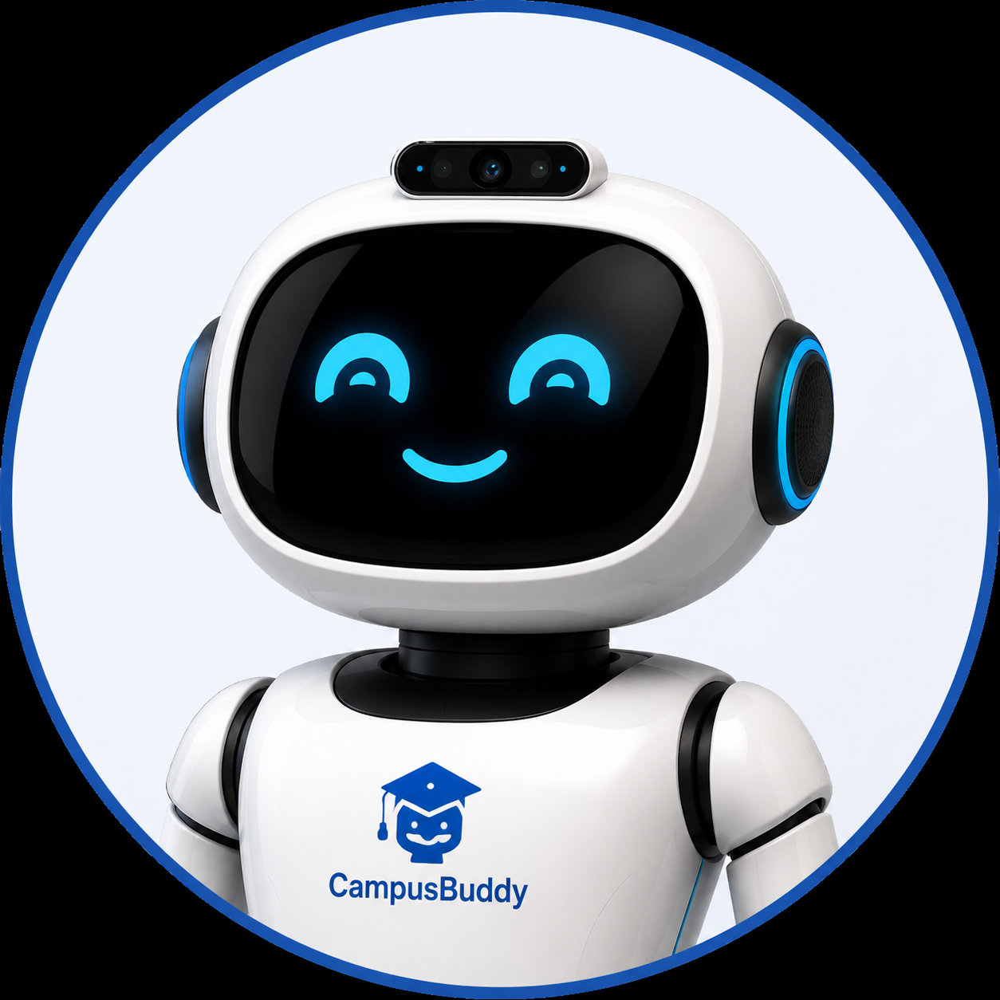

<div align="center">



# 🤖 CampusBuddy
### AI-Powered Campus Kiosk Assistant for AIET, Moodubidri

> A voice-activated AI assistant kiosk for Alva's Institute of Engineering and Technology.
> Greets visitors by name using face recognition. Answers questions using RAG over real college data.
> Runs locally with a hybrid online/offline mode — works without internet once set up, and automatically uses richer online services when available.

</div>

---

## ✨ Features

| Feature | Description |
|---|---|
| 🎙️ Wake Word Detection | Say **"Hey Campus Buddy"** to activate |
| 🧠 RAG-Powered QA | Answers questions from real AIET data using LangChain + ChromaDB |
| 🔊 Hybrid Voice Output | gTTS (online, natural voice) with automatic fallback to pyttsx3 (offline, local voice) |
| 🌐 Hybrid Wake Word / STT | Google Speech API when online, local Whisper when offline — auto-detected |
| 👁️ Face Recognition | Identifies registered students and faculty using DeepFace + FaceNet512 |
| 📋 Voice Registration | New users can register face + details entirely by voice |
| 💬 WebSocket Real-Time | Live status updates between React UI and FastAPI backend |
| 🖥️ Kiosk UI | Fullscreen React UI with IdleScreen, ActiveScreen, and status overlays styled in AIET's brand colors |
| 📴 Offline-Capable | Core question-answering (Whisper STT + local Llama 3.2 + ChromaDB) works fully offline after first-time setup |

---

## 🌐 Online vs Offline Behavior

CampusBuddy is **not** a fully offline-only system — it's hybrid by design. Here's exactly what needs internet and when:

| Component | Needs Internet? | Notes |
|---|---|---|
| Wake word detection | Only for best accuracy | Falls back to local Whisper automatically if offline |
| Main question listening (STT) | No | Always uses local Whisper (`faster-whisper`, base model) |
| Text-to-speech | Only for natural voice | Falls back to local `pyttsx3` (Windows SAPI voice) automatically if offline |
| RAG question answering | No (after setup) | Llama 3.2 runs locally via Ollama, no cloud calls |
| Embedding model (`all-MiniLM-L6-v2`) | **Yes — one time only** | Must be downloaded once before first offline run (see Step 4 below) |

Connectivity is auto-detected before each TTS/STT call (`utils/network.py`) — no manual toggle needed.

---

## 🏗️ Tech Stack

### Backend
- **FastAPI** — WebSocket server and REST API
- **LangChain + ChromaDB** — RAG pipeline for AIET knowledge base
- **Ollama (Llama 3.2:1b)** — Local LLM for answer generation
- **HuggingFace (all-MiniLM-L6-v2)** — Sentence embeddings (cached locally after first download)
- **DeepFace (FaceNet512)** — Face recognition and embedding
- **faster-whisper** — Offline speech-to-text (STT), used for all main listening and as wake-word fallback
- **gTTS + pyttsx3** — Hybrid text-to-speech: gTTS online, pyttsx3 offline fallback
- **OpenCV** — Camera capture and face detection (DirectShow backend on Windows via `cv2.CAP_DSHOW`)

### Frontend
- **React 18** — Kiosk UI with multiple screen states
- **WebSocket** — Real-time communication with backend
- **CSS Animations** — Smooth transitions between IdleScreen and ActiveScreen

---

## 📁 Project Structure

```
campusbuddy/
│
├── api/
│   ├── main.py               ← FastAPI WebSocket server (entry point)
│   ├── stt.py                ← Hybrid speech-to-text (Whisper + Google fallback)
│   └── tts.py                ← Hybrid text-to-speech (gTTS + pyttsx3 fallback)
│
├── rag/
│   ├── ingest.py              ← Embeds AIET data into ChromaDB
│   └── query.py               ← RAG chain (LangChain + Ollama)
│
├── face/
│   ├── recognize.py           ← DeepFace embedding extraction
│   └── database.py            ← ChromaDB face store (save/find/count)
│
├── utils/
│   └── network.py             ← Connectivity check used by stt.py and tts.py
│
├── data/
│   ├── scraped/                ← Clean, manually structured AIET knowledge base (.txt)
│   └── chroma_db/               ← ChromaDB vector store (auto-generated, do not edit)
│
├── ui/
│   ├── src/
│   │   ├── components/
│   │   │   ├── IdleScreen.js     ← Kiosk idle display (AIET-themed)
│   │   │   └── ActiveScreen.js   ← Active conversation display
│   │   └── App.js
│   └── package.json
│
├── scraper.py                 ← Scrapes AIET website data (raw — must be cleaned before ingest)
├── kiosk_f.py                  ← One-click launcher (backend + browser)
├── check.py                    ← Dependency checker
├── requirements.txt
└── README.md
```

> ⚠️ **Note on `data/scraped/`:** Raw scraped output often contains noise (404 pages, navigation menus, mixed content) and should be manually cleaned into structured, factual `.txt` files before running `ingest.py`. See [Troubleshooting](#-troubleshooting) if answers seem inaccurate or repetitive.

---

## ⚙️ Setup & Installation

### Prerequisites

- Python 3.10+
- Node.js 18+
- [Ollama](https://ollama.com/) installed and running
- A webcam connected to the system
- A microphone connected to the system
- An internet connection for initial setup (one-time only — see Step 4)

---

### Step 1 — Clone the repository

```bash
git clone https://github.com/11DDBOY11/CampusBuddy.git
cd CampusBuddy
```

### Step 2 — Create and activate virtual environment

```bash
python -m venv .venv

# Windows
.venv\Scripts\activate.bat

# Linux / Mac
source .venv/bin/activate
```

### Step 3 — Install Python dependencies

```bash
pip install -r requirements.txt
pip install tensorflow==2.15.0 keras==2.15.0
pip install deepface==0.0.79
pip install pyttsx3
```

### Step 4 — Cache the embedding model (one-time, requires internet)

```bash
python -c "from langchain_huggingface import HuggingFaceEmbeddings; HuggingFaceEmbeddings(model_name='all-MiniLM-L6-v2')"
```

This downloads the model once to your local HuggingFace cache. After this, RAG works fully offline.

### Step 5 — Pull the LLM model via Ollama

```bash
ollama pull llama3.2:1b
```

### Step 6 — Scrape and clean AIET website data

```bash
python scraper.py
```

> Review the output in `data/scraped/` and manually clean it into structured, factual `.txt` files before proceeding. Raw scraped data is rarely clean enough to use as-is.

### Step 7 — Ingest data into ChromaDB

```bash
python rag/ingest.py
```

### Step 8 — Install React frontend

```bash
cd ui
npm install
cd ..
```

---

## 🚀 Running the Project

### Option A — One-click launcher

```bash
python kiosk_f.py
```

### Option B — Manual (two terminals)

**Terminal 1 — Backend:**
```bash
python -m uvicorn api.main:app --host 0.0.0.0 --port 8000 --reload
```

**Terminal 2 — Frontend:**
```bash
cd ui
npm start
```

Then open **http://localhost:3000** in your browser.

---

## 🎤 How to Use

1. The kiosk starts in **IdleScreen** — showing campus information
2. Say **"Hey Campus Buddy"** to wake it up
3. Ask any question about AIET — departments, placements, facilities, events, hostel, etc.
4. CampusBuddy responds in spoken English (online voice if connected, offline voice otherwise)
5. For **face registration**, say *"register"* or *"new user"* — the system will guide you by voice through capturing your face and saving your details
6. Once registered, the kiosk will **greet you by name** next time it sees your face
7. Say **"bye"** or **"goodbye"** at any time to end the session and return to the idle screen

---

## 🧪 Verify Installation

Run the dependency checker:

```bash
python check.py
```

Quick DeepFace test:
```bash
python -c "from deepface import DeepFace; print('DeepFace OK')"
```

Quick offline-mode test (disconnect internet first):
```bash
python -c "from api.tts import speak; speak('Testing offline voice')"
```

---

## 📸 Sample Questions to Ask

- *"What departments are available at AIET?"*
- *"Tell me about the placement record"*
- *"What are the facilities on campus?"*
- *"How do I apply for admission?"*
- *"What is the hostel facility like?"*
- *"Tell me about the Pragati placement drive"*

---

## 🛠️ Troubleshooting

| Problem | Fix |
|---|---|
| `uvicorn: app not found` | Use `python -m uvicorn api.main:app --port 8000` |
| Camera error `-1072873851` (MSMF) | Use `cv2.VideoCapture(0, cv2.CAP_DSHOW)` on Windows |
| DeepFace import error | Run `pip install tensorflow==2.15.0 keras==2.15.0 deepface==0.0.79` |
| Wake word not detecting | Check mic input device; speak clearly — *"Hey Campus Buddy"*. Offline mode uses Whisper, which is slightly slower than the online fallback |
| Ollama not responding | Run `ollama serve` in a separate terminal first |
| Bot says "I don't have that information" for everything | Your `data/scraped/*.txt` files likely contain raw scraped junk (404 pages, nav menus). Manually clean them into structured factual text, delete `data/chroma_db/`, and re-run `python rag/ingest.py` |
| Embedding model fails to load offline | Run Step 4 (one-time internet download) before attempting an offline run |
| Stop Speaking button doesn't stop audio | Ensure `main.py` has a `stop` action handler calling `stop_speech()`, and that `tts.py`'s playback loop checks the stop flag every ~50ms |
| Bot doesn't end session on "bye" | Confirm exit-phrase detection exists in `main.py` before the RAG call, sending a `goodbye` event back to the frontend |

---

## 👨‍💻 Author

**Darshan Dashyal**
B.E. Computer Science Engineering
Alva's Institute of Engineering and Technology, Moodubidri
USN: `4AL23CS035`

---

## 📄 License

This project is licensed under the [MIT License](LICENSE).

---

<div align="center">

Built with ❤️ at AIET, Moodubidri · Powered by Llama 3.2 · Hybrid Online/Offline

⭐ Star this repo if you found it useful!

</div>